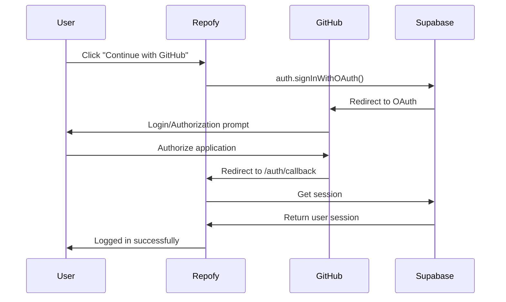

# GitHub OAuth Authentication Guide

## Overview

Your Repofy application now supports GitHub OAuth authentication as an alternative to email and phone verification. This allows users to sign up and sign in using their existing GitHub accounts, providing instant access without email delivery issues.

## Why GitHub Authentication?

### ✅ **Advantages**
- **No Email Issues**: Bypasses .edu email blocking completely
- **Instant Verification**: No waiting for emails or SMS codes
- **Perfect for Developers**: GitHub is already familiar to your target audience
- **Rich User Data**: Access to GitHub username, avatar, and public profile
- **Secure**: OAuth 2.0 standard with GitHub's robust security
- **Social Features**: Could integrate with user's GitHub repositories later

### 🎯 **Perfect for Repofy**
Since Repofy is a repository management platform, GitHub authentication makes perfect sense for your user base!

## Features Implemented

### 1. **Enhanced AuthForm Component**
- **Three verification methods**: Email, Phone, and GitHub
- **Dynamic UI**: Form adapts based on selected authentication method
- **GitHub OAuth Flow**: Seamless redirect to GitHub and back
- **No Password Required**: GitHub users don't need to create passwords

### 2. **GitHub Callback Handler**
- **GitHubCallbackPage.js**: Handles OAuth callback from GitHub
- **Session Management**: Properly establishes user session
- **Error Handling**: Graceful handling of authentication failures
- **User Feedback**: Clear status messages during the process

### 3. **Server-side Integration**
- **User Profile Creation**: Automatically creates profiles for GitHub users
- **GitHub Username**: Uses actual GitHub username as default
- **Metadata Handling**: Preserves GitHub user information
- **Avatar Support**: Can pull GitHub profile pictures

## How It Works

### User Experience Flow

#### **Sign Up with GitHub**
1. User clicks "🐙 GitHub" verification method
2. Sees friendly GitHub signup interface
3. Clicks "🐙 Continue with GitHub" button
4. Redirects to GitHub OAuth page
5. User authorizes Repofy application
6. Returns to Repofy with instant account creation
7. Profile automatically populated with GitHub data

#### **Sign In with GitHub**
1. User clicks "🐙 Sign in with GitHub" button (available on both signup and login)
2. Redirects to GitHub OAuth
3. Returns with active session
4. Instant access to the application

### Technical Flow



## Setup Requirements

### 1. **GitHub OAuth App Configuration**

You need to create a GitHub OAuth application:

1. **Go to GitHub Settings**:
   - Visit https://github.com/settings/applications/new
   - Or go to GitHub → Settings → Developer settings → OAuth Apps → New OAuth App

2. **Configure Application**:
   ```
   Application name: Repofy
   Homepage URL: https://repofy-frontend.onrender.com (or your domain)
   Application description: Personal mini GitHub - simplified and fast
   Authorization callback URL: https://hckwulwucbvxlslltoxy.supabase.co/auth/v1/callback
   ```

3. **Get Credentials**:
   - Note the `Client ID`
   - Generate a `Client Secret`

### 2. **Supabase Configuration**

Configure GitHub provider in Supabase:

1. **Navigate to Supabase Dashboard**:
   - Go to Authentication → Settings → Auth Providers

2. **Enable GitHub Provider**:
   ```javascript
   // Enable GitHub provider
   GitHub: ON
   
   // Add your GitHub OAuth credentials:
   Client ID: your_github_client_id
   Client Secret: your_github_client_secret
   
   // Set redirect URL (auto-configured)
   Redirect URL: https://your-project.supabase.co/auth/v1/callback
   ```

3. **Configure Scopes** (optional):
   ```
   Default scopes: user:email
   Additional scopes: read:user (for public profile data)
   ```

### 3. **URL Configuration**

Update your environment URLs if needed:

```javascript
// In AuthForm.js - already configured
const FRONTEND_URL = process.env.NODE_ENV === 'production'
  ? 'https://repofy-frontend.onrender.com'
  : 'http://localhost:3000';
```

## User Interface

### Signup Experience
- **Radio button selection**: Users can choose GitHub alongside email/phone
- **No form fields**: GitHub users see a clean, simple interface
- **Clear messaging**: "Sign up with your GitHub account for instant access!"
- **Branded button**: Recognizable GitHub styling with octopus emoji

### Login Experience
- **Dual options**: Users can still use traditional login OR GitHub
- **Prominent placement**: GitHub button appears below traditional form
- **Consistent styling**: Matches GitHub's brand colors
- **Hover effects**: Interactive feedback for better UX

## Code Examples

### Basic GitHub Authentication

```javascript
// GitHub OAuth sign-in (already implemented in AuthForm.js)
const handleGitHubAuth = async () => {
  const { error } = await supabase.auth.signInWithOAuth({
    provider: 'github',
    options: {
      redirectTo: `${FRONTEND_URL}/auth/callback`
    }
  });
  
  if (error) console.error('GitHub auth error:', error);
};
```

### Accessing GitHub User Data

```javascript
// After successful authentication
const { data: { user } } = await supabase.auth.getUser();

// GitHub-specific data available in user.user_metadata:
const githubUsername = user.user_metadata?.user_name;
const githubAvatar = user.user_metadata?.avatar_url;
const githubName = user.user_metadata?.full_name;
const githubEmail = user.email; // Primary email from GitHub
```

## Security Considerations

### OAuth Security
- **Secure Redirect**: Only allows configured callback URLs
- **State Parameter**: Supabase handles CSRF protection
- **Short-lived Tokens**: GitHub access tokens have limited lifespan
- **Scope Limitation**: Only requests necessary permissions

### Data Privacy
- **Minimal Data**: Only requests email and basic profile information
- **No Repository Access**: Doesn't request repo permissions (yet)
- **User Control**: Users can revoke access anytime in GitHub settings

### Session Management
- **Supabase Sessions**: Standard session security
- **Token Refresh**: Automatic token refresh handling
- **Logout Support**: Proper session cleanup

## Troubleshooting

### Common Issues

1. **"Invalid redirect URI" Error**:
   - Check GitHub OAuth app callback URL matches Supabase
   - Ensure no trailing slashes in URLs
   - Verify development vs production URLs

2. **User Not Found After Callback**:
   - Check network tab for authentication errors
   - Verify Supabase project URL is correct
   - Ensure GitHub OAuth app is not suspended

3. **Profile Creation Issues**:
   - Check server logs for database errors
   - Verify user_profiles table schema
   - Ensure proper username uniqueness handling

### Debug Steps

1. **Check OAuth Configuration**:
   ```bash
   # Verify GitHub OAuth app settings
   # Check Supabase auth provider settings
   # Test callback URL manually
   ```

2. **Monitor Network Requests**:
   ```javascript
   // Check browser DevTools → Network tab
   // Look for failed requests to /auth/callback
   # Verify session establishment
   ```

3. **Server-side Debugging**:
   ```javascript
   // Add logging to server user profile creation
   console.log('GitHub user data:', user.user_metadata);
   console.log('Profile creation result:', result);
   ```

## Future Enhancements

### Potential GitHub Integrations

1. **Repository Import**: Allow users to import from their GitHub repos
2. **Profile Sync**: Sync GitHub profile updates automatically
3. **Social Features**: Show mutual GitHub connections
4. **Repository Stats**: Display GitHub contribution data
5. **Team Features**: GitHub organization integration

### Additional OAuth Providers

Based on GitHub's success, you could add:
- **GitLab**: For GitLab users
- **Bitbucket**: Alternative Git platform
- **Google**: Broader user base
- **Discord**: Developer community platform

## API Endpoints

The GitHub authentication integrates with existing endpoints:

- `GET /profile` - Works with GitHub users
- `POST /profile` - Updates GitHub user profiles
- `POST /profile/avatar` - Can use GitHub avatars
- All repository endpoints work normally

## Benefits Summary

### For Users
- ✅ **No email hassles**: Skip .edu email problems entirely
- ✅ **Instant access**: No verification codes or waiting
- ✅ **Familiar process**: Everyone knows GitHub OAuth
- ✅ **Rich profiles**: Automatic username and avatar
- ✅ **Secure**: Industry-standard OAuth security

### For Your Application
- ✅ **Higher conversion**: Removes signup friction
- ✅ **Better user data**: Real names and usernames
- ✅ **Platform alignment**: Perfect fit for developer tool
- ✅ **Future integrations**: Foundation for GitHub features
- ✅ **Reduced support**: Fewer email/verification issues

## Conclusion

GitHub OAuth authentication provides the perfect solution for your .edu email delivery issues while offering a superior user experience for your developer-focused audience. Users can sign up instantly, bypass email verification entirely, and start using Repofy immediately with their familiar GitHub identity.

This implementation maintains security best practices while providing the smoothest possible onboarding experience for your target users.
